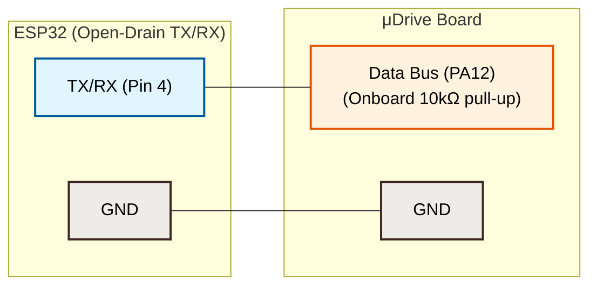
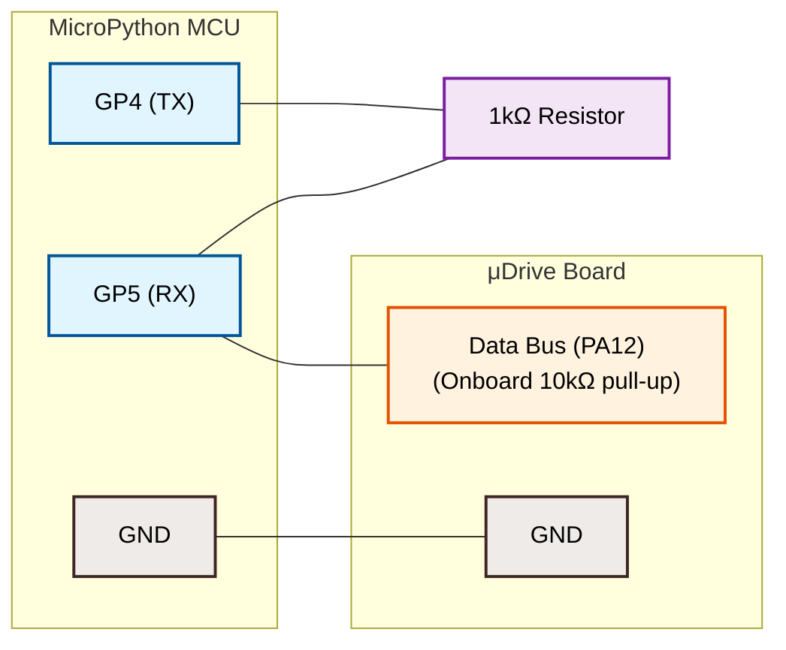

# 📖 MicroPython API Reference

Complete API documentation for the `microdrive.py` driver library.

**Source:** [`micropython/microdrive.py`](../micropython/microdrive.py)

---

## Table of Contents

- [Quick Start](#quick-start)
- [ServoBus](#servobus)
- [Servo](#servo)
  - [Movement](#movement)
  - [Status & Error](#status--error)
  - [Configuration (Individual)](#configuration-individual)
  - [Configuration (Bulk)](#configuration-bulk)
  - [Convenience](#convenience)
- [ServoStatus](#servostatus)
- [ServoConfigData](#servoconfigdata)
- [Protocol Details](#protocol-details)
- [Wiring Diagrams](#wiring-diagrams)
- [Utility Scripts](#utility-scripts)

---

## Quick Start

```python
from machine import UART, Pin
from microdrive import ServoBus

uart = UART(1, baudrate=250000, tx=Pin(4), rx=Pin(5))
bus  = ServoBus(uart)
servo = bus.servo(0)

# Move to 180° at default velocity
servo.move(180)

# Poll current state
status = servo.poll()
print(status)  # <ServoStatus angle=180° current=42mA>
```

---

## ServoBus

```python
ServoBus(uart, dir_pin=None, reply_timeout_ms=5)
```

Manages the shared half-duplex UART bus for one or more Microdrives.

### Parameters

| Parameter | Type | Default | Description |
|---|---|---|---|
| `uart` | `machine.UART` | *(required)* | Pre-configured UART instance at **250,000 baud, 8N1**. TX pin wired to the servo bus line. |
| `dir_pin` | `machine.Pin` or `None` | `None` | Optional direction control pin (active-high = transmit). Set to `None` if the UART handles half-duplex natively or if using a shared open-drain TX/RX line. |
| `reply_timeout_ms` | `int` | `5` | Milliseconds to wait for a servo reply before giving up. The firmware replies in ~2.7 ms on average. |

### Methods

#### `servo(servo_id) → Servo`

Create a `Servo` handle bound to this bus.

| Parameter | Type | Description |
|---|---|---|
| `servo_id` | `int` | The servo's bus address (**0–127**). ID 0 targets factory-default / unconfigured servos. |

```python
servo = bus.servo(0)
```

---

#### `broadcast_move(angle, velocity=0, current=0)`

Move **all** servos on the bus simultaneously. No reply is expected (broadcast address `0xFE`).

| Parameter | Type | Default | Description |
|---|---|---|---|
| `angle` | `int` | *(required)* | Target angle in degrees |
| `velocity` | `int` | `0` | Temporary velocity in deg/s. `0` = use each servo's flash default |
| `current` | `int` | `0` | Temporary current/force limit in mA. `0` = use each servo's flash default |

```python
bus.broadcast_move(90, velocity=200)
```

---

#### `broadcast_clear_error()`

Clear faults on **all** servos (no reply expected). Also resets PID state and locks the target angle to the current physical position on each servo.

```python
bus.broadcast_clear_error()
```

---

#### `broadcast_disarm()`

Disarm all servos on the bus, turning off H-bridges so that all servo shafts spin completely freely. This is an alias for `broadcast_clear_error()`.

```python
bus.broadcast_disarm()
```

---

#### `scan(id_range=range(0, 128)) → list[(int, ServoStatus)]`

Scan the bus for connected servos by polling each ID in the range.

Returns a list of `(servo_id, ServoStatus)` tuples for every servo that replied.

| Parameter | Type | Default | Description |
|---|---|---|---|
| `id_range` | `range` | `range(0, 128)` | Range of IDs to scan |

> [!NOTE]
> Scanning is slow — each non-responding ID waits for the full reply timeout. Narrow the range if you know the expected IDs.

```python
found = bus.scan(id_range=range(0, 10))
for sid, status in found:
    print(f"ID {sid}: {status.angle}° {status.current_ma}mA")
```

---

## Servo

```python
# Do not instantiate directly — use bus.servo(id) instead
servo = bus.servo(1)
```

High-level interface to a single Microdrive on the bus.

### Properties

| Property | Type | Description |
|---|---|---|
| `id` | `int` | This servo's bus address (read-only) |

---

### Movement

#### `move(angle, velocity=0, current=0) → None`

Command the servo to move to the target angle. Returns immediately (fire-and-forget, no reply expected).

| Parameter | Type | Default | Description |
|---|---|---|---|
| `angle` | `int` | *(required)* | Target angle in degrees (clamped to configured limits) |
| `velocity` | `int` | `0` | Temporary movement speed in deg/s. `0` = use flash default |
| `current` | `int` | `0` | Temporary force/current limit in mA. `0` = use flash default |

```python
servo.move(90)
servo.move(180, velocity=300, current=800)
```

> [!IMPORTANT]
> The motor **does not move** until the first `move()` command is received after power-on. This is a safety feature — the H-bridge stays off until then.

---

#### `move_and_wait(angle, velocity=0, timeout_ms=10000) → ServoStatus | None`

Send a move command and **block** until the servo reports it has reached the target (i.e., `is_moving` becomes `False`).

| Parameter | Type | Default | Description |
|---|---|---|---|
| `angle` | `int` | *(required)* | Target angle in degrees |
| `velocity` | `int` | `0` | Temporary velocity in deg/s |
| `timeout_ms` | `int` | `10000` | Max time to wait before returning `None` |

Returns the final `ServoStatus`, or `None` on timeout.

```python
status = servo.move_and_wait(180, velocity=200, timeout_ms=5000)
if status:
    print(f"Arrived at {status.angle}°")
```

---

#### `wait_until_done(timeout_ms=10000, poll_interval_ms=50) → ServoStatus | None`

Block until the servo reports it has finished moving, or until timeout. Polls the servo at the given interval.

| Parameter | Type | Default | Description |
|---|---|---|---|
| `timeout_ms` | `int` | `10000` | Max time to wait |
| `poll_interval_ms` | `int` | `50` | Polling interval |

```python
servo.move(90)
# ... do other work ...
final = servo.wait_until_done()
```

---

#### `is_moving() → bool`

Poll the servo and return `True` if it is currently in motion.

```python
if servo.is_moving():
    print("Still moving...")
```

---

### Status & Error

#### `poll() → ServoStatus | None`

Request the servo's current status without changing anything. Returns a `ServoStatus` object, or `None` on timeout.

```python
status = servo.poll()
if status:
    print(f"{status.angle}° — {status.current_ma} mA")
```

---

#### `clear_error() → None`

Clear the overcurrent fault flag, reset PID integrator memory, and lock the target angle to the servo's current physical position.

```python
servo.clear_error()
```

---

#### `disarm() → None`

Disarm the motor H-bridge, disabling power so the shaft spins freely. The servo re-arms automatically upon the next `move()` command. This is an alias for `clear_error()`.

```python
servo.disarm()
```

---

### Configuration (Individual)

Each setter sends a fixed-length CONFIG packet with only its corresponding update-mask bit set. The firmware ignores all fields whose mask bits are not active.

> [!NOTE]
> Configuration changes are **saved to flash** by default and persist across power cycles. Use the `ram_only=True` flag on `set_pid()` or `configure()` to apply changes temporarily (useful for rapid PID tuning without wearing out flash).

---

#### `set_id(new_id, direction_invert=False) → ServoStatus | None`

Change the servo's bus address and/or motor direction.

| Parameter | Type | Default | Description |
|---|---|---|---|
| `new_id` | `int` | *(required)* | New servo ID (**0–127**). 0 = unconfigured. |
| `direction_invert` | `bool` | `False` | `True` to invert the motor rotation direction |

```python
servo.set_id(5)
# After changing the ID, create a new handle:
servo = bus.servo(5)
```

> [!WARNING]
> After changing the ID, the old `Servo` handle is stale. Always create a new one with `bus.servo(new_id)`.

---

#### `set_angle_limits(min_angle, max_angle) → ServoStatus | None`

Set the software-enforced angle limits (degrees). The servo will clamp any move command to these bounds.

| Parameter | Type | Description |
|---|---|---|
| `min_angle` | `int` | Minimum allowable target angle |
| `max_angle` | `int` | Maximum allowable target angle |

```python
servo.set_angle_limits(0, 180)
```

---

#### `set_velocity(max_velocity) → ServoStatus | None`

Set the flash-stored default velocity limit in degrees per second. This is used when `velocity=0` is passed to `move()`.

| Parameter | Type | Description |
|---|---|---|
| `max_velocity` | `int` | Default maximum velocity (deg/s) |

```python
servo.set_velocity(200)
```

---

#### `set_current_limit(current_limit) → ServoStatus | None`

Set the over-current fault threshold in milliamps.

| Parameter | Type | Description |
|---|---|---|
| `current_limit` | `int` | Current draw threshold (mA) |

```python
servo.set_current_limit(1000)
```

---

#### `set_pid(kp=None, ki=None, kd=None, ram_only=False) → ServoStatus | None`

Set PID gains. Accepts **float** values — they are converted to Q16.16 fixed-point internally.

| Parameter | Type | Default | Description |
|---|---|---|---|
| `kp` | `float` or `None` | `100.0` | Proportional gain |
| `ki` | `float` or `None` | `0.05` | Integral gain |
| `kd` | `float` or `None` | `8.0` | Derivative gain |
| `ram_only` | `bool` | `False` | If `True`, update RAM only (skip flash save) |

> [!IMPORTANT]
> All three gains are written as a group. If you pass `None` for any gain, the firmware default is used (Kp=100.0, Ki=0.05, Kd=8.0). Always provide all three values together when tuning.

```python
# Tune PID in RAM (fast iteration, no flash wear)
servo.set_pid(kp=80.0, ki=0.03, kd=12.0, ram_only=True)

# Save final values to flash
servo.set_pid(kp=80.0, ki=0.03, kd=12.0)
```

---

#### `set_calibration(zero_adc, adc_per_360) → ServoStatus | None`

Set the physical ADC calibration mapping for the potentiometer.

| Parameter | Type | Description |
|---|---|---|
| `zero_adc` | `int` | Raw ADC value corresponding to 0° |
| `adc_per_360` | `int` | Number of ADC ticks for a full 360° rotation |

```python
servo.set_calibration(zero_adc=120, adc_per_360=3200)
```

> [!TIP]
> Use the `manual_angle_calibrate.py` utility script to determine these values precisely for your motor.

---

### Configuration (Bulk)

#### `configure(...) → ServoStatus | None`

Update multiple configuration fields in a **single** CONFIG packet. Only the provided (non-`None`) fields are written; all others are left untouched on the servo.

```python
configure(
    servo_id=None,           # int: New bus address (0–127)
    direction_invert=None,   # bool: Invert motor direction
    min_angle=None,          # int: Minimum angle limit (degrees)
    max_angle=None,          # int: Maximum angle limit (degrees)
    max_velocity=None,       # int: Default velocity (deg/s)
    current_limit=None,      # int: Over-current threshold (mA)
    kp=None,                 # float: Proportional PID gain
    ki=None,                 # float: Integral PID gain
    kd=None,                 # float: Derivative PID gain
    zero_adc=None,           # int: Raw ADC at 0°
    adc_per_360=None,        # int: ADC ticks per 360°
    ram_only=False           # bool: Skip flash write
)
```

**Example — full initial configuration:**

```python
servo.configure(
    servo_id=1,
    direction_invert=False,
    min_angle=0,
    max_angle=200,
    max_velocity=180,
    current_limit=1000,
    kp=100.0, ki=0.05, kd=8.0,
)
```

**Example — change just the velocity:**

```python
servo.configure(max_velocity=300)
```

> [!NOTE]
> Angle limits (`min_angle`, `max_angle`) and calibration values (`zero_adc`, `adc_per_360`) must be provided **as a pair** — you cannot update one without the other.

---

#### `read_config() → ServoConfigData | None`

Request the servo's full persistent configuration stored in flash memory.

```python
config = servo.read_config()
if config:
    print(f"ID: {config.servo_id}")
    print(f"Limits: {config.min_angle}° – {config.max_angle}°")
    print(f"PID: Kp={config.kp:.2f} Ki={config.ki:.4f} Kd={config.kd:.2f}")
```

---

## ServoStatus

Returned by `poll()`, `move_and_wait()`, `wait_until_done()`, and configuration methods (when not broadcasting).

| Property | Type | Description |
|---|---|---|
| `angle` | `int` | Current physical angle in degrees (signed, can be negative) |
| `current_ma` | `int` | Motor current draw in milliamps |
| `is_moving` | `bool` | `True` if the servo is actively tracking a target |
| `overcurrent` | `bool` | `True` if an over-current fault is active |
| `is_holding` | `bool` | `True` if admittance yield mode is active (motor is complying/backdriving due to current limiting) |
| `has_fault` | `bool` | `True` if **any** fault flag is active (currently = `overcurrent`) |
| `servo_id` | `int` | Bus address of the servo that replied |
| `instruction` | `int` | Echoed instruction byte from the request |

**String representation:**

```python
>>> status = servo.poll()
>>> print(status)
<ServoStatus angle=90° current=42mA flags=HOLDING>
```

---

## ServoConfigData

Returned by `servo.read_config()`. Contains the persistent configuration stored in flash.

| Property | Type | Description |
|---|---|---|
| `servo_id` | `int` | Bus address (0–127) |
| `direction_invert` | `bool` | Whether motor direction is inverted |
| `min_angle` | `int` | Software minimum angle limit (degrees) |
| `max_angle` | `int` | Software maximum angle limit (degrees) |
| `max_velocity` | `int` | Default velocity in deg/s |
| `current_limit` | `int` | Over-current fault threshold in mA |
| `kp` | `float` | Proportional PID gain (converted from Q16) |
| `ki` | `float` | Integral PID gain (converted from Q16) |
| `kd` | `float` | Derivative PID gain (converted from Q16) |
| `zero_adc` | `int` | Raw ADC value at 0° |
| `adc_per_360` | `int` | ADC ticks per full 360° rotation |
| `magic` | `int` | Flash validity marker |

**String representation:**

```python
>>> config = servo.read_config()
>>> print(config)
<ServoConfigData id=1 dir_invert=False limits=0°-200° max_vel=180
 current_lim=1000mA kp=100.00 ki=0.0500 kd=8.00
 zero_adc=120 adc_per_360=3200 magic=0xCAFE>
```

---

## Protocol Details

The servo bus uses a binary packet protocol over half-duplex UART:

| Field | Description |
|---|---|
| **Header** | `0xFF 0xFF` (2 bytes) |
| **Servo ID** | Target address (1 byte, `0xFE` = broadcast) |
| **Length** | Number of remaining bytes: instruction + params + checksum |
| **Instruction** | Command byte (see below) |
| **Parameters** | Little-endian payload (variable length) |
| **Checksum** | `~(sum of ID + Length + Instruction + Params) & 0xFF` |

### Instruction Codes

| Code | Name | Direction | Description |
|---|---|---|---|
| `0x01` | `CONTROL` | Master → Servo | Move command (angle, velocity, current) |
| `0x02` | `CONFIG` | Master → Servo | Write configuration fields |
| `0x03` | `POLL` | Master → Servo | Request status (servo replies with 11-byte status) |
| `0x04` | `CLEAR_ERR` | Master → Servo | Clear faults, reset PID, disarm H-bridge |
| `0x05` | `READ_CONFIG` | Master → Servo | Read flash config (servo replies with 36-byte config) |

### Reply Packet Sizes

| Reply Type | Total Bytes |
|---|---|
| **Status reply** | 11 bytes |
| **Config reply** | 36 bytes |

---

## Wiring Diagrams

### Single-Wire Bus Layout

#### Option A: For boards with open-drain UART support (e.g., ESP32)
If your microcontroller supports native half-duplex UART or allows configuring the TX pin as open-drain, you can connect the TX pin directly to the data bus. No external pull-up is needed because the μDrive PCB already includes an onboard 10kΩ pull-up resistor on the data bus:



#### Option B: For boards without open-drain UART support (e.g., Raspberry Pi Pico / RP2040)
If your board does not support open-drain UART, do **not** tie the TX and RX pins directly together. Instead, connect the RX pin directly to the servo data bus, and connect the TX pin to the RX pin/bus through a **1kΩ isolation resistor**. This protects the TX pin from short circuits when the MCU TX drives the pin high while the servo drives the bus low:



> [!TIP]
> - The **1kΩ resistor** acts as an isolation resistor between the TX and RX/data line on the MCU side. When the MCU transmits a logic low, it pulls the data line down through the resistor. When the servo transmits, the resistor protects the microcontroller's TX pin if it remains driven high.
> - The μDrive board has an onboard **10kΩ pull-up resistor** on the Data Bus, so no external pull-up is required. An external pull-up (e.g., 4.7kΩ to 3.3V) is only needed if your custom master or bus setup lacks one.

---

## Utility Scripts

The `micropython/` folder includes several ready-to-use scripts:

| Script | Description |
|---|---|
| [example.py](../micropython/example.py) | Interactive quick-start & configuration utility. Scans for servos, shows telemetry, and enters a move-and-track loop with real-time status printing. |
| [calibrate_pid.py](../micropython/calibrate_pid.py) | **Automated PID tuner** using a gradient-ascent step-response algorithm. Finds the friction floor (Kp), determines the spring limit, damps overshoot (Kd), and injects integral gain (Ki). Saves results to flash. |
| [hard_angle_set.py](../micropython/hard_angle_set.py) | **Automatic hard-limit calibration.** Sweeps the servo to measure average dynamic current, then slowly probes in each direction until a current spike reveals the physical end-stops. Saves `min_angle` and `max_angle` to flash. |
| [manual_angle_calibrate.py](../micropython/manual_angle_calibrate.py) | **Manual multi-point potentiometer calibration.** Temporarily sets ADC scale to 1:1 so `angle` telemetry mirrors the raw ADC, then prompts you to align the shaft to 0° and 90° by hand. Computes and saves `zero_adc` and `adc_per_360`. |
| [serial_proxy.py](../micropython/serial_proxy.py) | **Serial bridge for the WebGUI.** Reads JSON commands from USB `stdin`, translates them to servo bus packets, and returns JSON responses. Supports `scan`, `move`, `poll`, `read_config`, `configure`, and `clear_error` commands. |
| [stream_current.py](../micropython/stream_current.py) | **Real-time current monitor.** Continuously polls and prints the servo's current draw — useful for verifying current sensing against a multimeter. |
| [speedtest.py](../micropython/speedtest.py) | **Feature & config sweep test.** Verifies scanning, config read/write, fault clearing, and runs a continuous angle sweep (20°→220°→20° in 40° steps) with real-time telemetry at each step. |

### Running Utility Scripts

1. Copy `microdrive.py` and the desired script onto the microcontroller.
2. Connect the servo bus and power supply.
3. Open a serial terminal (Thonny, `mpremote`, PuTTY) and run:

```python
import calibrate_pid  # or any other script
```

---

## Tested Boards

The driver uses only standard MicroPython APIs and should work on any board with a UART peripheral:

- ✅ Raspberry Pi Pico / Pico W (RP2040)
- ✅ ESP32 / ESP32-S3
- ✅ STM32 (Pyboard)
- ✅ ESP8266
